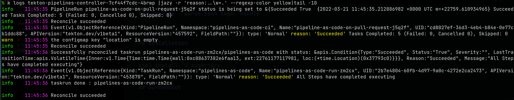

# sugarjazy - parse json logs nicely

sugarjazy is a simple tool to parse json logs and output them in a nice format with nice colors.

Usually play nicely with <https://github.com/uber-go/zap> when using the ["Sugar"](https://pkg.go.dev/go.uber.org/zap#Logger.Sugar) logger output.

## Installation

There is not many dependencies on this package but [`python-dateutil`](https://dateutil.readthedocs.io/en/stable/) is an optional dependency, if the package is not installed you will not be be able to show the log timestamps.

### Arch

You can install it [from aur](https://aur.archlinux.org/packages/sugarjazy) with your aurhelper, like yay :

```
yay -S sugarjazy
```

### pip

With pip from pypi - <https://pypi.org/project/sugarjazy/>

```
pip install --user sugarjazy
```

(make sure $HOME/.local/bin is in your PATH)

## Screenshot



## Usage

You can use `sugarjazy` in multiple ways :

- By piping your logs: `kubectl logs podname|sugarjazy`
- By streamining your logs: `kubectl logs -f podname|sugarjazy -s`
- Or with the file (or multiples files) directly: `sugarjazy /tmp/file1.log /tmp/file2.log`
- By using kail from https://github.com/boz/kail with the `--kail` flag, by
  default it will not print the prefix of the pods/container unless you specify
  the option `--kail-prefix`. The `--kail` always assume streaming implicitely.

### Arguments:

```shell
usage: sugarjazy [-h] [--timeformat TIMEFORMAT]
                 [--regexp-highlight REGEXP_HIGHLIGHT]
                 [--disable-event-colouring] [--filter-level FILTER_LEVEL]
                 [--stream] [--kail] [--kail-prefix]
                 [--regexp-color REGEXP_COLOR] [--hide-timestamp]
                 [files ...]

positional arguments:
  files

options:
  -h, --help            show this help message and exit
  --timeformat TIMEFORMAT
                        timeformat default only to the hour:minute:second. Use
                        "%Y-%m-%d %H:%M:%S" if you want to add the year
  --regexp-highlight REGEXP_HIGHLIGHT, -r REGEXP_HIGHLIGHT
                        Highlight a regexp in message, eg: "Failed:\s*\d+,
                        Cancelled\s*\d+"
  --disable-event-colouring
                        Add a  with a color to the eventid to easily identify
                        which event belongs to which
  --filter-level FILTER_LEVEL, -F FILTER_LEVEL
                        filter levels separated by commas, eg: info,debug
  --stream, -s          wait for input stream
  --kail, -k            assume streaming logs from kail
                        (https://github.com/boz/kail)
  --kail-prefix         wether to print the prefix when in kail mode
  --regexp-color REGEXP_COLOR
                        Regexp highlight color
  --hide-timestamp, -H  don't show timestamp
```

## *`NOTE`*

- Sugarjazy tries hard to identify the same event and add all events on the same colors to the chevron character ().
- The json fields are not standardize. It works well with `knative` based
  controllers like `tekton` or others but that may be buggy for other ones.

## Copyright

[Apache-2.0](./LICENSE)

## Authors

Chmouel Boudjnah <[@chmouel](https://twitter.com/chmouel)>
