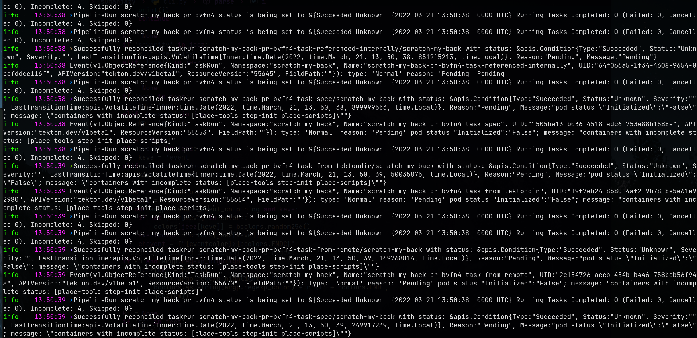

# sugarjazy - parse json logs nicely

sugarjazy is a simple tool to parse json logs and output them in a nice format with nice colors.

Usually play nicely with <https://github.com/uber-go/zap> when using the ["Sugar"](https://pkg.go.dev/go.uber.org/zap#Logger.Sugar) log.

## Installation

```shell
pip3 install -U sugarjazy
```

[`python-dateutil`](https://dateutil.readthedocs.io/en/stable/) is an optional dependency, if the package is not installed you will not be be able to show the log timestamps.

## Screenshot



## Usage

```shell
% sugarjazy --help
usage: jazy [-h] [--timeformat TIMEFORMAT] [--regexp-highlight REGEXP_HIGHLIGHT] [--regexp-color REGEXP_COLOR] [--hide-timestamp] [files ...]

positional arguments:
  files

options:
  -h, --help            show this help message and exit
  --timeformat TIMEFORMAT
                        timeformat default only to the hour minute. Use "%Y-%m-%d %H:%M:%S" if you want to add the year
  --regexp-highlight REGEXP_HIGHLIGHT, -r REGEXP_HIGHLIGHT
                        Highlight a regexp in message, for example: \"Failed:\s*\d+, Cancelled\s*\d+\"
  --regexp-color REGEXP_COLOR
                        Regexp highlight color
  --hide-timestamp, -H  don't show timestamp
  ```

## Copyright

[Apache-2.0](./LICENSE)

## Authors

Chmouel Boudjnah <[@chmouel](https://twitter.com/chmouel)>
